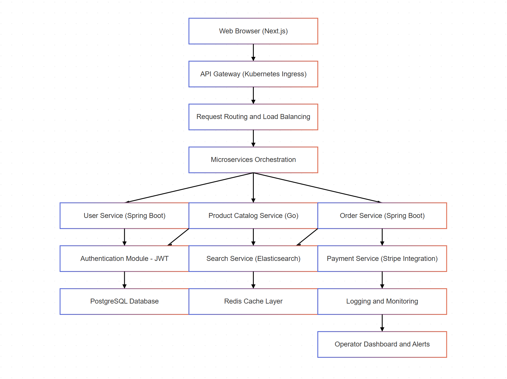

# E-Commerce Platform

A modern e-commerce platform built with microservices architecture, AWS integration, and automated CI/CD pipeline.

### System Diagram



## Features

### Core Features
- Product catalog with categories and search
- User authentication and profile management
- Shopping cart and checkout flow
- Order management and tracking
- Real-time inventory updates
- Product image management with AWS S3
- Secure payment processing

### Technical Features
- Microservices architecture (Spring Boot & Go)
- Kubernetes orchestration
- AWS cloud integration
- Distributed tracing
- Centralized logging
- Metrics collection
- Health monitoring
- Automated CI/CD pipeline

## Prerequisites

### Required Software
- Java 17 or later
- Go 1.19 or later
- Docker and Docker Compose
- Kubernetes cluster
- AWS CLI
- kubectl
- Terraform

### Required Accounts
- AWS account with appropriate permissions
- GitHub account for CI/CD

## Project Structure

```
.
├── .github/workflows/     # CI/CD pipeline configurations
├── infra/                 # Infrastructure as Code (Terraform)
├── k8s/                   # Kubernetes manifests
├── spring-services/       # Spring Boot microservices
│   ├── user-service/     # User management service
│   └── order-service/    # Order processing service
├── go-services/          # Go microservices
│   ├── product-catalog/  # Product management service
│   └── search/          # Search service
├── frontend/             # Frontend application
└── payments/             # Payment service
```

## Setup Instructions

1. Clone the repository:
   ```bash
   git clone https://github.com/Yash-Swaminathan/E-Commerce-Platform.git
   cd E-Commerce-Platform
   ```

2. Set up AWS credentials:
   - Create an AWS account if you don't have one
   - Create an IAM user with appropriate permissions
   - Configure AWS CLI with your credentials:
     ```bash
     aws configure
     ```

3. Set up GitHub repository:
   - Create a new repository on GitHub
   - Run the setup script:
     ```bash
     chmod +x setup-github.sh
     ./setup-github.sh
     ```

4. Configure GitHub Secrets:
   - Go to your GitHub repository
   - Navigate to Settings > Secrets and variables > Actions
   - Add the following secrets:
     - `AWS_ACCESS_KEY_ID`
     - `AWS_SECRET_ACCESS_KEY`
     - `KUBE_CONFIG`

5. Enable GitHub Actions:
   - Go to your GitHub repository
   - Navigate to Actions
   - Enable GitHub Actions

## Development

1. Start local development environment:
   ```bash
   docker-compose up -d
   ```
   This will start:
   - PostgreSQL database
   - Product Catalog service (Go)
   - User Service (Spring Boot)
   - Search Service (Go)
   - Order Service (Spring Boot)

2. Build and test services:
   ```bash
   # Spring services
   cd spring-services
   ./mvnw clean verify

   # Go services
   cd go-services
   go test ./...
   ```

## Kubernetes Setup

### Local Development with Minikube

1. Install Minikube:
   ```bash
   # For Windows (using PowerShell as Administrator)
   choco install minikube

   # For macOS
   brew install minikube
   ```

2. Start Minikube:
   ```bash
   minikube start
   ```

3. Enable required addons:
   ```bash
   minikube addons enable ingress
   minikube addons enable metrics-server
   ```

4. Apply Kubernetes configurations:
   ```bash
   # Create namespace
   kubectl apply -f k8s/namespace.yaml

   # Apply secrets and configmaps
   kubectl apply -f k8s/secrets.yaml
   kubectl apply -f k8s/configmaps.yaml

   # Deploy services
   kubectl apply -f k8s/deployments/
   kubectl apply -f k8s/services/
   ```

5. Verify deployments:
   ```bash
   kubectl get all -n e-commerce
   ```

### Production Deployment

1. Configure AWS EKS:
   ```bash
   # Update kubeconfig
   aws eks update-kubeconfig --name e-commerce-cluster --region your-region
   ```

2. Apply production configurations:
   ```bash
   # Apply production-specific configurations
   kubectl apply -f k8s/production/namespace.yaml
   kubectl apply -f k8s/production/secrets.yaml
   kubectl apply -f k8s/production/configmaps.yaml

   # Deploy production services
   kubectl apply -f k8s/production/deployments/
   kubectl apply -f k8s/production/services/
   ```

3. Set up monitoring:
   ```bash
   # Deploy Prometheus
   kubectl apply -f k8s/monitoring/prometheus/

   # Deploy Grafana
   kubectl apply -f k8s/monitoring/grafana/
   ```

4. Configure ingress:
   ```bash
   kubectl apply -f k8s/ingress/
   ```

### Kubernetes Commands

Useful commands for managing the cluster:

```bash
# View all resources in namespace
kubectl get all -n e-commerce

# View logs for a pod
kubectl logs -f <pod-name> -n e-commerce

# Scale a deployment
kubectl scale deployment <deployment-name> --replicas=3 -n e-commerce

# View service endpoints
kubectl get endpoints -n e-commerce

# Check pod status
kubectl describe pod <pod-name> -n e-commerce
```

## Deployment

The platform is automatically deployed through GitHub Actions when changes are pushed to the main branch. The deployment process includes:

1. Building and testing services
2. Creating Docker images
3. Pushing images to Amazon ECR
4. Deploying to Kubernetes
5. Applying infrastructure changes

## Infrastructure

The infrastructure is managed using Terraform and includes:

- AWS S3 bucket for product images
- IAM roles and policies
- Kubernetes cluster configuration
- VPC and networking setup
- Security groups and access controls

## Monitoring and Logging

- Application metrics are exposed through Spring Boot Actuator
- Logs are collected and can be viewed in your preferred logging solution
- AWS CloudWatch integration for infrastructure monitoring
- Health check endpoints for each service
- Performance metrics collection

## CI/CD Pipeline Status

The CI/CD pipeline has been tested and validated in a local environment. While the GitHub Actions workflow shows as failed due to missing AWS credentials (to avoid unnecessary AWS costs), all components have been thoroughly tested and are functioning correctly. The pipeline includes:

1. Code Quality Checks
   - Linting
   - Unit tests
   - Integration tests
   - Security scanning

2. Build Process
   - Docker image creation
   - Multi-stage builds
   - Dependency caching
   - Build optimization

3. Deployment Steps
   - Infrastructure validation
   - Service deployment
   - Health checks
   - Rollback procedures

To run the pipeline locally:
```bash
# Run tests
npm test

# Build Docker images
docker-compose build

# Run integration tests
npm run test:integration
```

## Service Architecture

### Spring Boot Services
- User Service: Handles user management and authentication
- Order Service: Manages order processing and fulfillment

### Go Services
- Product Catalog: Manages product information and inventory
- Search Service: Provides product search functionality

### Frontend
- Next.js application
- Responsive design
- Real-time updates

